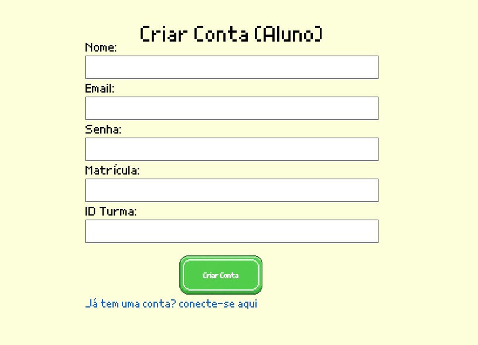
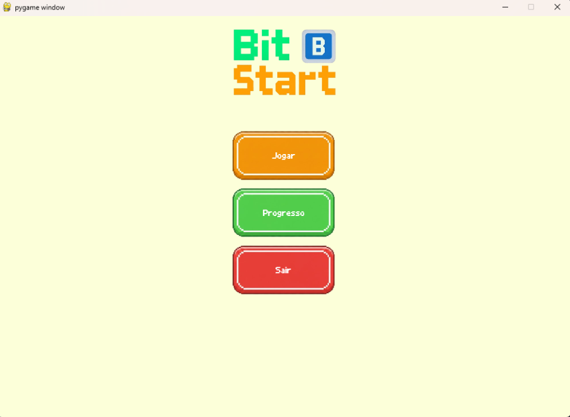
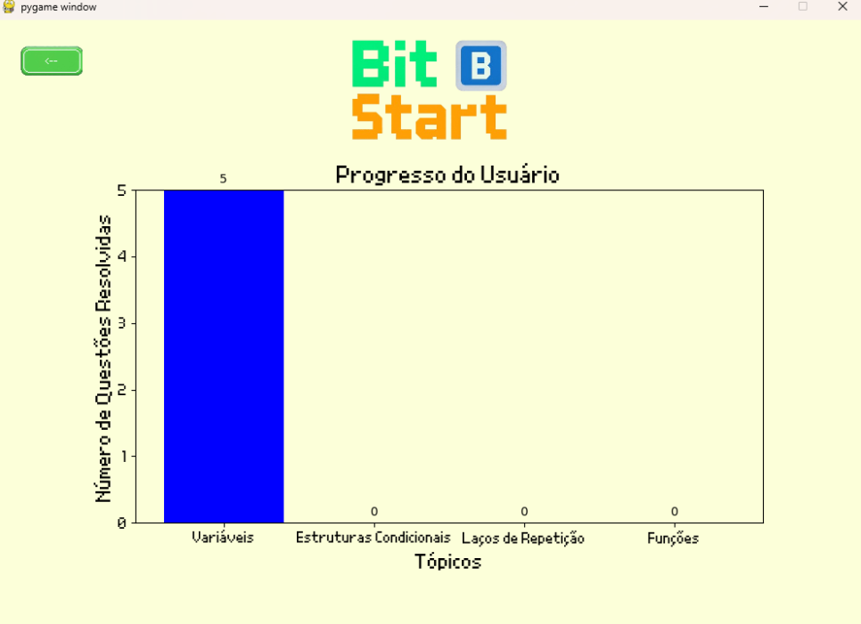

# Projeto de Engenharia de Software - Bit Start

Este repositório contém o código-fonte do projeto "Bit Start", desenvolvido como parte da disciplina de Engenharia de Software, semestre 2025.2, na Universidade Federal Rural do Semi-Árido (UFERSA).

## Objetivo do Sistema

O BitStart é um jogo educacional voltado ao ensino introdutório de algoritmos e lógica  de programação para alunos ingressantes no curso de BTI - UFERSA. Com uma identidade  visual inspirada em jogos pixelados 8-bit, o aplicativo busca tornar o aprendizado de conceitos básicos de lógica e programação mais interativo, acessível e lúdico. O jogo é composto por fases de quizes e puzzles que desafiam os jogadores a aplicar conceitos fundamentais de algoritmos, como estruturas condicionais, loops e variáveis. 

## Principais  Funcionalidades

|FUNCIONALIDADE|DESCRIÇÃO|
|---|---|
|Registrar-se e vincular-se a uma turma|Ao se registrar informando nome, e-mail, senha, matrícula e ID da turma, o aluno é automaticamente vinculado à turma previamente cadastrada correspondente ao ID fornecido.|
|Jogar as fases em ordem sequencial|O aluno só desbloqueia a próxima fase ao concluir critérios mínimos da atual (ex.: chegar a X% de acerto ou resolver com sucesso).|
|Ter feedback imediato em caso de erro|Durante o jogo, o sistema fornece feedback imediato e detalhado sempre que o usuário comete um erro, apresentando uma mensagem explicativa, destacando o trecho incorreto (quando aplicável) e oferecendo sugestões didáticas, como qual conteúdo revisar. Além disso, o aluno pode tentar jogar a fase novamente, garantindo que o feedback seja sempre construtivo, educativo e não punitivo.|
|Consultar seu desempenho|O sistema conta com uma área pessoal onde o aluno pode visualizar seu desempenho, incluindo a quantidade de acertos em cada fase.|
|Salvar o progresso do aluno|O aluno tem acesso ao próprio progresso, podendo visualizar as fases já jogadas e seu desempenho nelas.|
## Tecnologias Utilizadas

- Linguagem de Programação: Python


- Biblioteca Gráfica: Pygame

- Controle de Versão: Git

- Banco de Dados: Supabase

## Como Executar o Projeto

1. Clone este repositório para sua máquina local:
   ```bash
   git clone
   ```

2. Navegue até o diretório do projeto:
   ```bash
    cd ProjetoEngSoftware
    ```

3. Instale as dependências necessárias:
    ```bash
    pip install -r requirements.txt
    ```

4. Execute o aplicativo:
    ```bash
    python -m src.main
    ```

## Como navegar/testar o protótipo
Ao executar o aplicativo, siga as instruções na tela para navegar pelo jogo. 

- Você pode registrar-se, vinculando-se a uma turma já cadastrada atraves do ID da turma (inicialmente, a única turma cadastrada é a 1). Também é possível fazer login caso já possua uma conta.



- Após o login, você poderá jogar as fases, consultar seu desempenho ou sair.



- Ao escolher a opção "Jogar", você será direcionado para as fases disponíveis. Complete os desafios para desbloquear fases subsequentes.


- Na seção "Desempenho", você poderá visualizar suas estatísticas de jogo, incluindo acertos e progresso.



- Ao clicar em "Sair", você retornará à tela inicial, podendo fazer login com outro usuário ou registrar-se novamente.
## Integrantes do Grupo

<table align="center">
  <tr>    
    <td align="center">
      <a href="https://github.com/letsticia">
        <br>
        <sub>
          <b>Letícia Gonçalves</b>
         </sub>
      </a>
    </td>
    <td align="center">
      <a href="https://github.com/alexrbss">
        <br>
        <sub>
          <b>Rubens Alexandre</b>
         </sub>
      </a>
    </td>
    <td align="center">
      <a href="https://github.com/biiaalmeida">
        <br>
        <sub>
          <b>Ana Beatriz Almeida</b>
         </sub>
      </a>
    </td>
    <td align="center">
      <a href="https://github.com/hillaryds">
        <br>
        <sub>
          <b>Hillary Diniz</b>
         </sub>
      </a>
    </td>
  </tr>
</table>