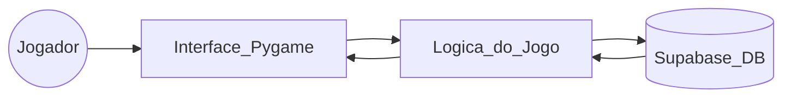
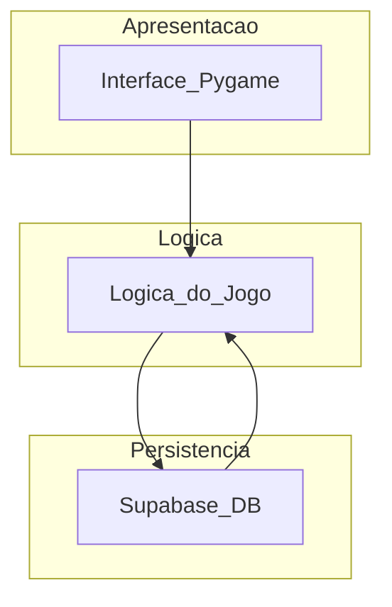

# Arquitetura Mínima – BitStart

## 1. Separação Mínima de Responsabilidades

A arquitetura do BitStart pode ser dividida em três blocos principais:

### 1.1. Camada de Apresentação (Interface Gráfica – Pygame)

Responsável por tudo que o jogador enxerga e com o que interage:

- Renderização de telas (menu, fases, quizzes, puzzles).
- Exibição de textos, imagens e feedbacks visuais.
- Captura de eventos (teclado, mouse).
- Controle do loop principal da interface.

### 1.2. Camada de Lógica de Jogo (Regras / Domínio)

Define como o jogo funciona internamente:

- Estrutura das fases e perguntas.
- Validação de respostas.
- Cálculo de pontuação.
- Controle do estado do jogo (MENU → FASE → RESULTADO → etc.).
- Comunicação com a persistência quando necessário.

### 1.3. Camada de Persistência / Infraestrutura (Supabase)

Responsável por armazenar e recuperar dados fora da memória:

- Conexão com o Supabase.
- Salvamento de progresso do jogador.
- Armazenamento de pontuação e ranking.
- Consulta de informações persistidas.

---

## 2. Fluxo Básico do Sistema

Fluxo simplificado do funcionamento do jogo:

### **Inicialização**
- Pygame é iniciado, assets são carregados e o menu inicial é exibido.

### **Menu Inicial**
- Jogador seleciona iniciar fase, ver fases, ou sair.

### **Seleção e execução de fase**
- Interface solicita à lógica que carregue a fase escolhida.
- Lógica retorna perguntas, alternativas e estado inicial.

### **Jogada do usuário**
- Jogador escolhe alternativas.
- Interface repassa ações à lógica.
- Lógica valida e retorna o resultado.

### **Persistência**
- Ao final da fase, a lógica solicita à camada de infraestrutura que salve progresso e pontuação no Supabase.

### **Resultado**
- Interface exibe acertos, erros e opções de retornar ou jogar outra fase.

### **Encerramento**
- Pygame é fechado e recursos são liberados.

## 3. Tecnologias Selecionadas

| Categoria      | Tecnologia                 | Função                                                 |
|----------------|----------------------------|---------------------------------------------------------|
| Linguagem      | **Python 3.x**             | Base do projeto                                         |
| Interface      | **Pygame**                 | Criação de gráficos, menus, eventos e telas             |
| Backend/Banco  | **Supabase (PostgreSQL + API)** | Persistência de dados, ranking e progresso      |
| Versionamento  | **Git + GitHub**           | Controle de versão e colaboração                        |
| Dependências   | **requirements.txt**       | Lista oficial de bibliotecas do projeto                 |

---

## 4. Diagramas Simples

A seguir, diagramas simples que mostram a arquitetura mínima solicitada pela disciplina.

### 4.1. Diagrama de Fluxo – Visão Geral

### 4.2. Diagrama por Camadas – Arquitetura Mínima

### Funções dos Integrantes do Projeto

| Área / Função                     | Integrante(s)                | Responsabilidades Principais                                  |
|-----------------------------------|------------------------------|----------------------------------------------------------------|
| Documentação e Identidade da marca | Hillary      | Documentação geral, identidade visual, marcação da entrevista |
| Apoio na Documentação            | Todos                        | Criação de diagramas e revisão da documentação                      |
| Desenvolvimento (Principal)      | Letícia                      | Desenvolvimento principal do sistema/jogo                     |
| Desenvolvimento (Apoio)          | Hillary, Alexandre           | Apoio no desenvolvimento                            |
| Banco de Dados                   | Ana Beatriz                  | Criação do banco de dados e estrutura no Supabase             |
| Conteúdo das Questões            | Ana Beatriz                  | Produção e organização das questões utilizadas no jogo        |
| Criação de assets originais            | Letícia, Hillary                  | Produção de assets originiais como: botões, nave, robô e fontes       |
